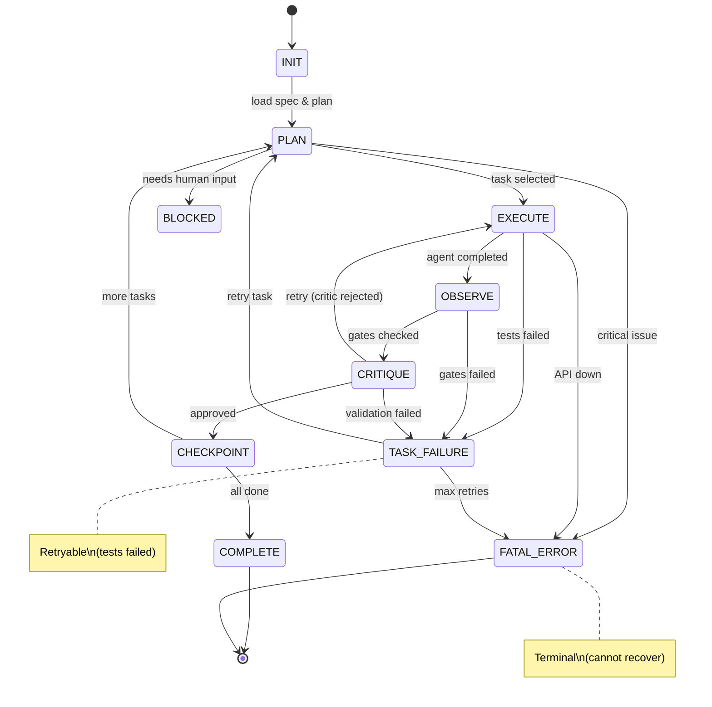

# Architecture

Darkzloop's architecture is designed for **computational efficiency** and **agent reliability**. It implements seven key optimizations that layer on top of the core methodology.

## Overview

```
┌─────────────────────────────────────────────────────────────────────────┐
│                        DARKZLOOP ARCHITECTURE                           │
├─────────────────────────────────────────────────────────────────────────┤
│                                                                         │
│   ┌───────────────┐   ┌───────────────┐   ┌───────────────┐            │
│   │    VISUAL     │   │   EXECUTION   │   │     DATA      │            │
│   │    LAYER      │   │    LAYER      │   │    LAYER      │            │
│   │  (Dual-Mode)  │   │  (GIL-Aware)  │   │    (JSON)     │            │
│   │               │   │               │   │               │            │
│   │   The Map     │   │  The Engine   │   │   The Fuel    │            │
│   └───────┬───────┘   └───────┬───────┘   └───────┬───────┘            │
│           │                   │                   │                     │
│           └───────────────────┼───────────────────┘                     │
│                               │                                         │
│                      ┌────────▼────────┐                               │
│                      │  CONTROL LAYER  │                               │
│                      │ (FSM+Manifest)  │                               │
│                      │                 │                               │
│                      │   The Rails     │                               │
│                      └────────┬────────┘                               │
│                               │                                         │
│                      ┌────────▼────────┐                               │
│                      │     CRITIC      │                               │
│                      │  (Reflection)   │                               │
│                      │                 │                               │
│                      │  The Guardian   │                               │
│                      └─────────────────┘                               │
│                                                                         │
└─────────────────────────────────────────────────────────────────────────┘
```

## The Seven Optimizations

### 1. Finite State Machine (FSM) - The Rails

**Problem**: Agents often "hallucinate" next steps that don't exist, jumping from PLAN to FINISH without executing.

**Solution**: A strict FSM enforces valid state transitions with **distinct failure states**.

```python
# Key distinction: TASK_FAILURE vs FATAL_ERROR
class LoopState(Enum):
    INIT = "init"
    PLAN = "plan"
    EXECUTE = "execute"
    OBSERVE = "observe"
    CRITIQUE = "critique"
    CHECKPOINT = "checkpoint"
    COMPLETE = "complete"
    TASK_FAILURE = "task_failure"  # Retryable (tests failed)
    FATAL_ERROR = "fatal_error"    # Terminal (API down, auth invalid)
    BLOCKED = "blocked"
```

**Why split failure states?**

| State | Cause | Can Retry? | Example |
|-------|-------|------------|---------|
| `TASK_FAILURE` | Tests failed, lint error | ✅ Yes | `cargo test` returns non-zero |
| `FATAL_ERROR` | API down, max retries | ❌ No | LLM API 500 error, 3 consecutive failures |

**Transitions:**
```
TASK_FAILURE → PLAN (retry the task)
TASK_FAILURE → FATAL_ERROR (too many retries)
FATAL_ERROR → (nothing - terminal state)
```

**Code**: `core/fsm.py`

```python
from darkzloop.core import LoopController, LoopState

loop = LoopController()

# On test failure - retryable
loop.fsm.fail_task("tests failed", can_retry=True)
# -> state = TASK_FAILURE

# After 3 consecutive failures - escalate
if loop.fsm.consecutive_failures >= 3:
    loop.fsm.escalate_to_fatal("max retries exceeded")
# -> state = FATAL_ERROR (loop stops)
```

### 2. Token Pruning / Rolling Windows - Context Economy

**Problem**: In recursive loops, context windows explode. A 10-iteration loop can accumulate 50K+ tokens of history, degrading agent performance.

**Solution**: Implement a "Summarization Gate" that compresses old iterations.

```
Before: [Step 1 detailed] -> [Step 2 detailed] -> [Step 3 detailed] -> ...
After:  [Summary of 1-2] -> [Step 3 detailed]
```

**Implementation**:
- Keep only N recent detailed steps (default: 5)
- Compress completed iterations into one-line summaries (~50 tokens)
- Use the Mermaid graph as compressed "memory" of what happened

**Code**: `core/context.py`

```python
from darkzloop.core import ContextManager

ctx = ContextManager({"max_summaries": 10, "target_tokens": 4000})

# After each iteration, compress to summary
ctx.checkpoint(
    iteration=1,
    task_id="1.1",
    outcome="success",
    key_changes=["src/model.rs"],
    one_liner="Created Event model"
)

# Summaries are ultra-compact
# "[i1] 1.1: success | src/model.rs | Created Event model"
```

### 3. Structured JSON - The Fuel

**Problem**: Parsing natural language is slow and error-prone. "I think I should search the docs" is ambiguous.

**Solution**: Force structured JSON for all agent I/O.

```json
{
  "action": "search_code",
  "target": "authentication",
  "reason": "Finding existing auth patterns"
}
```

**Benefits**:
- 100% deterministic parsing
- Faster than NLP
- Validatable (fail fast on invalid output)

**Code**: `core/schemas.py`

```python
from darkzloop.core import AgentAction, validate_agent_output

# Validate agent output before wasting tokens
action = AgentAction(
    action="write_file",
    target="src/model.rs",
    content="pub struct Event {}",
    reason="Creating model"
)

valid, error = action.validate()
if not valid:
    # Hard fail immediately, don't continue loop
    raise ValueError(error)
```

### 4. DAG Executor - GIL-Aware Parallelism

**Problem**: Sequential execution is slow. If Task A and Task B are independent, running them sequentially wastes time.

**Solution**: Parse the plan into a DAG, detect parallel branches, execute simultaneously with **GIL-aware executor selection**.

**Python's GIL Problem:**
```
ThreadPoolExecutor  → Good for I/O-bound (LLM API calls, file reads)
ProcessPoolExecutor → Good for CPU-bound (cargo check, pylint, mypy)
```

**Code**: `core/dag.py`

```python
from darkzloop.core import DAGExecutor

dag = DAGExecutor()
dag.add_node("1.1", task_data, dependencies=[])
dag.add_node("1.2", task_data, dependencies=[])
dag.add_node("2.1", task_data, dependencies=["1.1", "1.2"])

# For LLM API calls (I/O-bound) - use ThreadPool (default)
result = await dag.execute_async(llm_executor_fn, use_process_pool=False)

# For local analysis (CPU-bound) - use ProcessPool
result = await dag.execute_async(lint_executor_fn, use_process_pool=True)
```

**Shell Command Helpers:**
```python
from darkzloop.core import run_shell_command_async, run_shell_command_sync

# Run quality gates without blocking event loop
success, stdout, stderr = await run_shell_command_async(
    "cargo test",
    cwd="/path/to/project",
    timeout=300
)

# Or synchronous version
success, stdout, stderr = run_shell_command_sync("npm run lint")
```

### 5. Critic / Reflection - The Guardian

**Problem**: Loops drift off-course. An agent might spend 5 iterations going down a rabbit hole.

**Solution**: Add a "Critic" checkpoint before expensive execution. A lightweight check asks: "Does this action match the goal?"

**Implementation**:
- Rule-based critic (fast, no LLM)
- Optional LLM critic (more thorough)
- Runs before EXECUTE, catches errors early

**Code**: `core/critic.py`

```python
from darkzloop.core import quick_critique

# Quick validation before execution
should_proceed, reason = quick_critique(
    action={"action": "write_file", "target": "src/auth.rs"},
    task={"files_to_create": ["src/model.rs"]},  # Note: different file!
    goal="Create Event model"
)

if not should_proceed:
    # "file_in_scope: Target 'src/auth.rs' is NOT in task scope"
    print(f"Critic blocked action: {reason}")
```

### 6. Context Manifest - Read Before Write (Context-Aware)

**Problem**: Agent tries to edit a file it hasn't seen, causing incorrect modifications. Even worse: agent read the file 10 iterations ago, but it's been **pruned from context** due to token limits.

**Solution**: The manifest tracks not just "was read" but "is currently in context window". If context compression removes a file, `can_write()` flips back to `False`.

**Code**: `core/manifest.py`

```python
from darkzloop.core import ContextManifest

manifest = ContextManifest.from_task({
    "files_to_modify": ["src/api/routes.rs"],
    "files_to_create": ["src/api/events.rs"],
    "reference_files": ["src/api/users.rs"],
})

# Read the file (adds to context)
manifest.record_read("src/api/routes.rs", token_count=500)

# Can write because file is in context
allowed, reason = manifest.can_write("src/api/routes.rs")
# -> True, "allowed_write"

# Later: context window prunes the file to save tokens
manifest.prune_from_context("src/api/routes.rs")

# NOW: can_write returns False!
allowed, reason = manifest.can_write("src/api/routes.rs")
# -> False, "'src/api/routes.rs' was read but pruned from context - must re-read"
```

**Why this matters**: Most agent failures happen because they hallucinate file contents. By enforcing that files are **currently** in context (not just historically read), we prevent blind edits.

**Auto-Hint on Failure**: When `can_write()` fails, the manifest generates a hint to inject into the next prompt:

```python
hint = manifest.get_hint_for_failure("src/routes.rs")
# -> "⚠️ SYSTEM NOTE: You attempted to edit 'src/routes.rs', but it fell out of 
#     your context window. You MUST run `read_file src/routes.rs` again before editing."
```

This saves the agent from guessing why it failed.

### 7. File Locking - Parallel Safety

**Problem**: When running tasks in parallel, two branches might edit the same file causing merge conflicts the agent cannot solve.

**Solution**: File-aware DAG scheduling. Tasks claim files, and conflicts force sequential execution.

**Rule**: "If Branch A claims routes.rs, Branch B acts on auth.rs. If both need routes.rs, they must run sequentially."

**Code**: `core/locks.py`

```python
from darkzloop.core import FileAwareDAGScheduler

scheduler = FileAwareDAGScheduler()

# Register tasks
scheduler.register_task({"id": "2.1", "files_to_modify": ["src/routes.rs"]})
scheduler.register_task({"id": "2.2", "files_to_modify": ["src/routes.rs"]})

# Original parallel plan
original = [["2.1", "2.2"]]  # Would conflict!

# Reorder to avoid conflicts
safe = scheduler.reorder_execution_plan(original)
# -> [["2.1"], ["2.2"]]  # Now sequential

# Or check before starting
can_start, blockers = scheduler.can_start_task("2.2")
# -> False, ["2.1"]  # 2.1 holds the lock
```

---

## Dual-Mode Visualization

The visualization layer serves **two audiences**:

### For Humans (Pretty)
```bash
darkzloop graph --format html
```
Generates interactive HTML with colored Mermaid diagrams, progress bars, and stats.

### For Agents (Compact)
```python
from darkzloop.core import render_for_agent

# Inject into agent context
context = render_for_agent(viz)
```

Output (optimized for minimal tokens):
```
[LOOP] state=execute iter=5 fails=0
[STATS] ✓3 ✗1 ◷2 ⊘1
[DAG]
  [1.1,1.2] --> [✓2.1]
  [2.1] --> [✗2.2]
    └─ ERROR: tests failed
  [2.2] --> [⊘3.1]
[BLOCKED]
  3.1: waiting on failed ['2.2']
[READY] ['2.3']
```

**Why dual-mode?** The agent sees the text DAG and immediately understands:
- Task 2.2 failed (tests)
- Task 3.1 is blocked because 2.2 failed
- Task 2.3 is ready to execute

This prevents the agent from attempting blocked tasks.

---

## Tiered Quality Gates (Backpressure)

Quality gates are organized into three tiers with different failure behaviors:

### Tier 1: Essential (Must Pass)
```json
{
  "tier1": {
    "enabled": true,
    "commands": ["cargo test", "cargo check"],
    "on_failure": "task_failure"
  }
}
```
- **Purpose**: Core correctness (tests, compilation)
- **On failure**: `TASK_FAILURE` (retryable)
- **Examples**: `cargo test`, `npm test`, `go test`, `cargo check`

### Tier 2: Quality (Should Pass)
```json
{
  "tier2": {
    "enabled": true,
    "commands": ["cargo fmt --check", "cargo clippy -- -D warnings"],
    "auto_fix_commands": ["cargo fmt"],
    "on_failure": "task_failure"
  }
}
```
- **Purpose**: Code quality (formatting, linting)
- **On failure**: Can auto-fix first, then `TASK_FAILURE` or `warning`
- **Examples**: `cargo fmt`, `eslint`, `black`, `mypy`

### Tier 3: Safety (When Enabled)
```json
{
  "tier3": {
    "enabled": false,
    "commands": ["cargo audit", "npm audit"],
    "on_failure": "blocked"
  }
}
```
- **Purpose**: Security and compliance
- **On failure**: `BLOCKED` (needs human review)
- **Examples**: `cargo audit`, `npm audit`, `bandit`, `trivy`

### Per-Task Circuit Breaker

To prevent infinite retry loops (`TASK_FAILURE → PLAN → TASK_FAILURE → ...`), each task has a retry counter:

```python
# FSM tracks retries per task
fsm.start_task("2.1")

# On failure, check retry count
next_state, message = fsm.record_task_failure("tests failed")

if next_state == LoopState.BLOCKED:
    # Too many retries - need human help
    print(f"Task blocked: {message}")  # "max_retries_exceeded (3)"
```

Configuration:
```json
{
  "loop": {
    "max_consecutive_failures": 3,
    "max_task_retries": 3
  }
}
```

---

## State Flow



---

## Context Structure

The context sent to the agent is structured for token economy:

```
=== GOAL ===
Build event analytics API

=== SPEC (relevant) ===
[Only sections relevant to current task]

=== STATE ===
[FSM] state=execute iter=3 fails=0 valid_next=['observe', 'task_failure']

=== DAG ===
[1.1,1.2] --> [✓2.1]
[2.1] --> [►2.2]
[READY] ['2.2']

=== HISTORY (compressed) ===
[i1] 1.1: success | migrations/005.sql | Created events migration
[i2] 1.2: success | src/models/event.rs | Created Event model

=== MANIFEST ===
⚠️ MUST READ FIRST: ['src/api/routes.rs']
Can modify: ['src/api/routes.rs']
Can create: ['src/api/handlers/events.rs']

=== CURRENT TASK ===
{
  "id": "2.1",
  "description": "Create events API handler",
  "files_to_create": ["src/api/events.rs"],
  "reference_files": ["src/api/users.rs"],
  "acceptance_criteria": "Handler compiles"
}
```

---

## Semantic Expansion (Vocabulary Gap)

**Problem**: Developers use different terms for the same concept. User says "billing", codebase says "invoicing". Agent searches for "billing", finds nothing, creates duplicate code.

**Solution**: Expand search terms to synonym clusters before searching.

```python
from darkzloop.core import SemanticExpander

expander = SemanticExpander(project_path)

# Expand "billing" to related terms
expansion = expander.expand("billing")
# -> {"billing": 1.0, "invoice": 0.9, "payment": 0.9, "subscription": 0.85, ...}

# Search using all synonyms
matches = expander.search_files(["billing"])
# -> Finds src/invoicing.rs, src/payments/handler.rs, etc.
```

### Built-in Synonym Clusters

The expander includes domain knowledge for common patterns:

```python
BUILTIN_SYNONYMS = {
    "login": ["auth", "signin", "authenticate", "session"],
    "cart": ["basket", "bag", "shopping_cart"],
    "billing": ["invoice", "payment", "subscription", "charge"],
    "user": ["account", "profile", "member", "identity"],
    "create": ["add", "new", "insert", "make"],
    # ... 50+ clusters
}
```

### Learning Glossary

The expander **learns** project-specific terminology:

```python
# When task succeeds, learn associations
expander.learn_from_success("billing", "src/invoicing/handler.rs")

# Next time, "billing" immediately maps to "invoicing"
expander.glossary.get_associations("billing")
# -> ["invoicing", "handler"]
```

Persisted to `.darkzloop/glossary.json`:
```json
{
  "learned": {
    "billing": ["invoicing", "payment"],
    "user": ["account", "profile"]
  },
  "term_frequencies": {
    "invoicing": 5,
    "payment": 3
  }
}
```

### Integration with System Prompt

The agent sees synonym clusters in its context:

```
═══════════════════════════════════════════════════════════════════════════════
                          SEMANTIC EXPANSION
═══════════════════════════════════════════════════════════════════════════════

When searching for code, use these synonym clusters:

- **billing** → invoice, payment, subscription, charge, stripe
- **user** → account, profile, member, identity

Example: If looking for "billing" code, also search for: invoice, payment, charge.
```

This prevents the agent from creating duplicate code when terminology differs.

---

## Runtime Integration

The `DarkzloopRuntime` ties all components together:

```python
from darkzloop.core import DarkzloopRuntime, LoopConfig, GateConfig
from pathlib import Path

# Load config
config = LoopConfig.from_file(Path("darkzloop.json"))

# Create runtime
runtime = DarkzloopRuntime(config)

# Set your agent executor
def my_agent(context: str, task: dict) -> tuple[bool, str, str]:
    # Your LLM/agent logic here
    # context includes the dynamic system prompt!
    return success, output, error

runtime.set_agent_executor(my_agent)

# Run entire plan
results = runtime.run()

# Or run single task
result = runtime.run_iteration(task)
```

### Dynamic System Prompt

The runtime automatically injects a **dynamic system prompt** that exposes:

1. **Manifest Protocol** - Files in context, files that must be read
2. **Circuit Breaker Status** - Retry count, warnings
3. **Tiered Gates** - Which quality checks must pass
4. **DAG Status** - Task dependencies and completion state

Template location: `templates/prompts/system.j2`

Example rendered prompt:
```
You are Darkzloop, an autonomous software engineer.
Current state: EXECUTE (iteration 3)

## MANIFEST PROTOCOL
Files in context: 2
  ✓ src/api/users.rs
  ✓ src/api/routes.rs

⚠️ MUST READ BEFORE WRITING:
  → src/api/events.rs

## CIRCUIT BREAKER
Task retries: 2 / 3
⚠️ WARNING: ONE attempt remaining!

## DAG STATUS
[LOOP] state=execute iter=3 fails=0
[STATS] ✓2 ✗0 ◷3 ⊘0
[DAG]
  [] --> [✓1.1]
  [] --> [✓1.2]
  [1.1,1.2] --> [►2.1]
[READY] ['2.1']
```

This prompt ensures the agent **knows the rules** before acting.

---

## File Structure

```
core/
├── __init__.py      # Public API exports
├── fsm.py           # FSM with TASK_FAILURE vs FATAL_ERROR
├── schemas.py       # JSON schemas (data layer)
├── context.py       # Token pruning (context economy)
├── critic.py        # Reflection checkpoints (validation)
├── dag.py           # GIL-aware parallel execution
├── runtime.py       # Main execution engine
├── manifest.py      # Context-aware read-before-write
├── locks.py         # File locking (parallel safety)
├── visualize.py     # Dual-mode visualization (human + agent)
└── semantic.py      # Vocabulary gap bridging (NEW)
```

---

## Design Principles

1. **Fail fast**: Validate early, don't waste tokens on doomed iterations
2. **Compress history**: Every token in context is precious
3. **Constrain choices**: Fewer valid actions = better agent performance
4. **Parallelize safely**: Independent tasks run together, conflicting tasks serialize
5. **Catch drift early**: Cheap validation beats expensive recovery
6. **Track context state**: Files pruned from context must be re-read
7. **Distinguish failure types**: Retryable errors should retry, fatal errors should stop

---

## Performance Characteristics

| Optimization | Token Savings | Speed Improvement |
|--------------|---------------|-------------------|
| FSM constraints | 10-20% | N/A (prevents waste) |
| Rolling windows | 50-80% | N/A (prevents degradation) |
| JSON schemas | 5-10% | Faster parsing |
| DAG parallelism | N/A | Up to Nx (task dependent) |
| Critic | 20-40% | Prevents rabbit holes |
| Context-aware manifest | 10-30% | Prevents blind edits |
| File locking | N/A | Prevents merge conflicts |
| Semantic expansion | 15-25% | Prevents duplicate code |

---

## Extending the Architecture

### Custom State Hooks

```python
from darkzloop.core import LoopController, LoopState

loop = LoopController()

def on_task_failure(fsm, context):
    print(f"Task failed! Consecutive failures: {fsm.consecutive_failures}")
    if fsm.consecutive_failures >= 3:
        # Custom escalation logic
        notify_human("Too many failures")

loop.register_hook(LoopState.TASK_FAILURE, on_task_failure)
```

### Custom Critic Rules

```python
from darkzloop.core import RuleBasedCritic

critic = RuleBasedCritic(
    goal="My goal",
    rules=[
        {
            "name": "no_console_log",
            "pattern": "console.log",
            "severity": "warning",
            "message": "Remove debug logging"
        },
        {
            "name": "no_force_push",
            "pattern": "git push --force",
            "severity": "error",
            "message": "Force push not allowed"
        }
    ]
)
```

### Custom Context Summarization

```python
from darkzloop.core import ContextManager

class MyContextManager(ContextManager):
    def custom_summarize(self, iteration_data):
        # Your summarization logic
        return f"Custom summary for {iteration_data['task_id']}"
```

### Agent-View Injection

```python
from darkzloop.core import Visualizer, render_for_agent

viz = Visualizer()
viz.load()

# Get compact text for agent context
agent_context = viz.get_agent_context()

# Inject into your LLM prompt
prompt = f"""
{agent_context}

Now execute the next ready task.
"""
```
